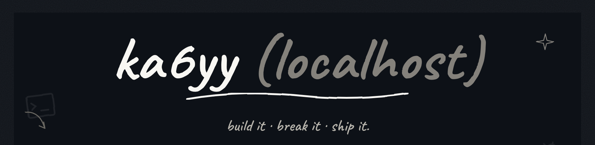
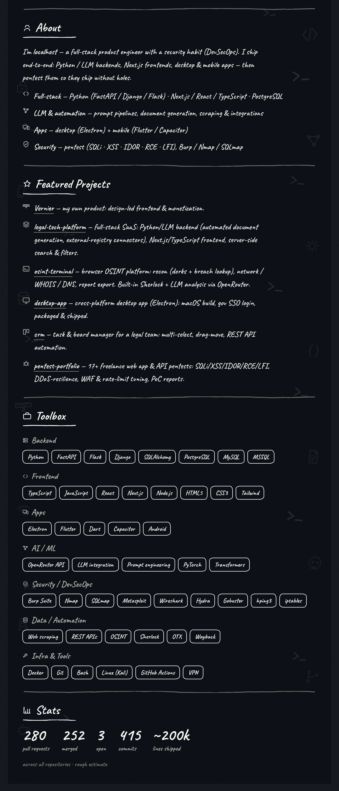

<!-- Profile README: github.com/ka6yy -->
<!-- Весь визуал запечён из chalk-дизайна в assets/cover-6.png (исходник: build/render-card.html). -->
<!-- Перерисовать: правь build/render-card.html → рендер headless-Chrome'ом → assets/cover-N.png (новое имя = сброс кэша camo) → обнови ссылку ниже. -->

  

  
  &nbsp;
  

  

<b>Text version</b> — selectable contacts, skills &amp; projects

 

**Contacts** — Telegram [@nynelocalhost](https://t.me/nynelocalhost) · GitHub [ka6yy](https://github.com/ka6yy)

## About
I'm **localhost** — a full-stack product engineer with a security habit (DevSecOps). I ship end-to-end: Python / LLM backends, Next.js frontends, desktop & mobile apps — then pentest them so they ship without holes.

- **Full-stack** — Python (FastAPI / Django / Flask) · Next.js / React / TypeScript · PostgreSQL
- **LLM & automation** — prompt pipelines, document generation, scraping & integrations
- **Apps** — desktop (Electron) + mobile (Flutter / Capacitor)
- **Security** — pentest (SQLi · XSS · IDOR · RCE · LFI), Burp / Nmap / SQLmap

## Featured Projects

**Vernier** — my own product: design-led frontend & monetization.

**legal-tech-platform** — full-stack SaaS: Python/LLM backend (automated document generation, external-registry connectors), Next.js/TypeScript frontend, server-side search & filters.

**osint-terminal** — browser OSINT platform: recon (dorks + breach lookup), network / WHOIS / DNS, report export. Built-in Sherlock + LLM analysis via OpenRouter.

**desktop-app** — cross-platform desktop app (Electron): macOS build, gov SSO login, packaged & shipped.

**crm** — task & board manager for a legal team: multi-select, drag-move, REST API automation.

**pentest-portfolio** — 17+ freelance web app & API pentests: SQLi/XSS/IDOR/RCE/LFI, DDoS-resilience, WAF & rate-limit tuning, PoC reports.

## Toolbox

**Backend** — Python · FastAPI · Flask · Django · SQLAlchemy · PostgreSQL · MySQL · MSSQL
**Frontend** — TypeScript · JavaScript · React · Next.js · Node.js · HTML5 · CSS3 · Tailwind
**Apps** — Electron · Flutter · Dart · Capacitor · Android
**AI / ML** — OpenRouter API · LLM integration · Prompt engineering · PyTorch · Transformers
**Security / DevSecOps** — Burp Suite · Nmap · SQLmap · Metasploit · Wireshark · Hydra · Gobuster · hping3 · iptables
**Data / Automation** — Web scraping · REST APIs · OSINT · Sherlock · OTX · Wayback
**Infra & Tools** — Docker · Git · Bash · Linux (Kali) · GitHub Actions · VPN

## Stats
Pull requests **280** · merged **252** · open **3** · commits **415** · lines shipped **~200k** — across all repositories (rough estimate).

